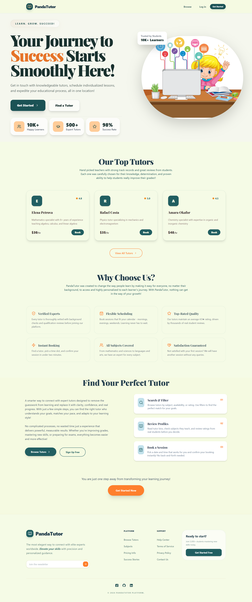
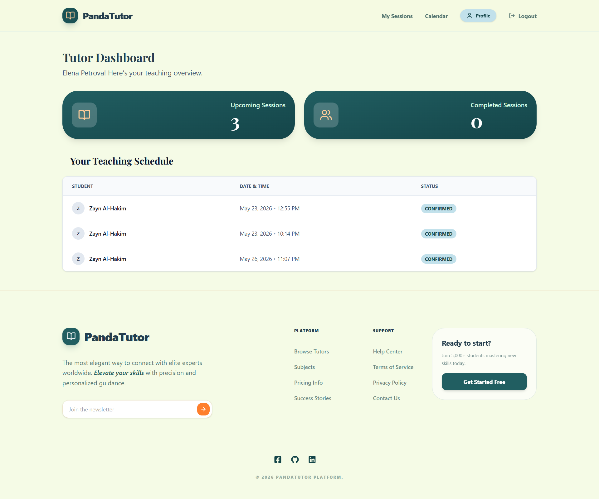
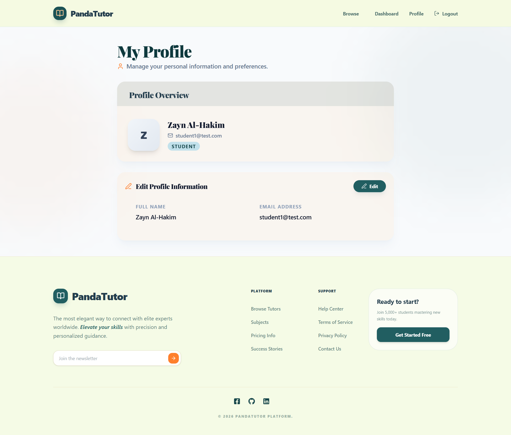

# PandaTutor

A full featured tutoring marketplace built with **Next.js**, **Express**, **Prisma**, **Tailwind CSS**, **Framer Motion**, **TanStack React Query v5**, and **Zustand**, connecting students with expert tutors for personalized, on demand learning sessions. Features role based dashboards for students, tutors, and admins, real time booking management, tutor availability scheduling, student reviews, and a fully responsive UI with smooth animations.

---

## Live Demo

- Frontend: [UI](https://panda-tutor-frontend.vercel.app/)
- Backend API: [API Server](https://pandatutor-backend.onrender.com/)

---

## Screenshots

### Home Page


### Tutor Dashboard


### Student Profile


---

## Tech Stack

### Frontend
- Next.js — SSR and routing
- Tailwind CSS — styling
- Framer Motion — animations
- TanStack Query — server state management
- Zustand — client state

### Backend
- Express.js — REST API
- Prisma — ORM
- PostgreSQL — database

---

## Key Features

- Protected dashboard routes
- UI updates with React Query
- Reusable modal and form components
- Tutor availability scheduling system
- JWT authentication with role based authorization
- Responsive UI
- RESTful API

---

## Pages

### Public
| Page | Route | Description |
|------|-------|-------------|
| Home | `/` | Landing page — hero, top tutors, features, steps |
| Browse Tutors | `/tutors` | Search by name, filter by category |
| Tutor Profile | `/tutors/:id` | Bio, reviews, availability, booking card |
| Login | `/login` | JWT-based authentication |
| Register | `/register` | Sign up as student or tutor |

### Student Dashboard
| Page | Route | Description |
|------|-------|-------------|
| Bookings | `/dashboard` | View and manage booked sessions |
| Profile | `/dashboard/profile` | Edit name and email |

### Tutor Dashboard
| Page | Route | Description |
|------|-------|-------------|
| Sessions | `/tutor/dashboard` | View all incoming bookings |
| Availability | `/tutor/availability` | Set weekly time slots |
| Profile | `/tutor/profile` | Edit bio, hourly rate, subjects |

### Admin Panel
| Page | Route | Description |
|------|-------|-------------|
| Dashboard | `/admin` | Platform stats overview |
| Users | `/admin/users` | View, ban, and unban users |
| Bookings | `/admin/bookings` | View all platform bookings |
| Categories | `/admin/categories` | Create, edit, delete subjects |

---

## Getting Started

### Prerequisites
- Node.js 18+
- PostgreSQL database (local or Neon)

### 1. Clone the repo

```bash
git clone https://github.com/noor00111/PandaTutor-frontend
git clone https://github.com/noor00111/PandaTutor-backend

```

### 2. Set up the backend

```bash
cd backend
npm install
```

```bash
npx prisma migrate dev
npm run seed
npm run dev
```

### 3. Set up the frontend

```bash
cd frontend
npm install
```

```bash
npm run dev
```

---

## Scripts

### Backend
| Script | Description |
|--------|-------------|
| `npm run dev` | Start dev server with tsx |
| `npm run build` | Compile TypeScript to `dist/` |
| `npm start` | Run compiled production build |
| `npm run seed` | Seed the database |
| `npm run prisma:generate` | Regenerate Prisma client |

### Frontend
| Script | Description |
|--------|-------------|
| `npm run dev` | Start development server |
| `npm run build` | Build for production |
| `npm start` | Start production server |
---

## Test Accounts

| Role | Email | Password |
|------|-------|----------|
| Admin | admin@PandaTutor.com | admin123 |
| Tutor | tutor1@test.com | tutor123 |
| Student | student1@test.com | student123 |
